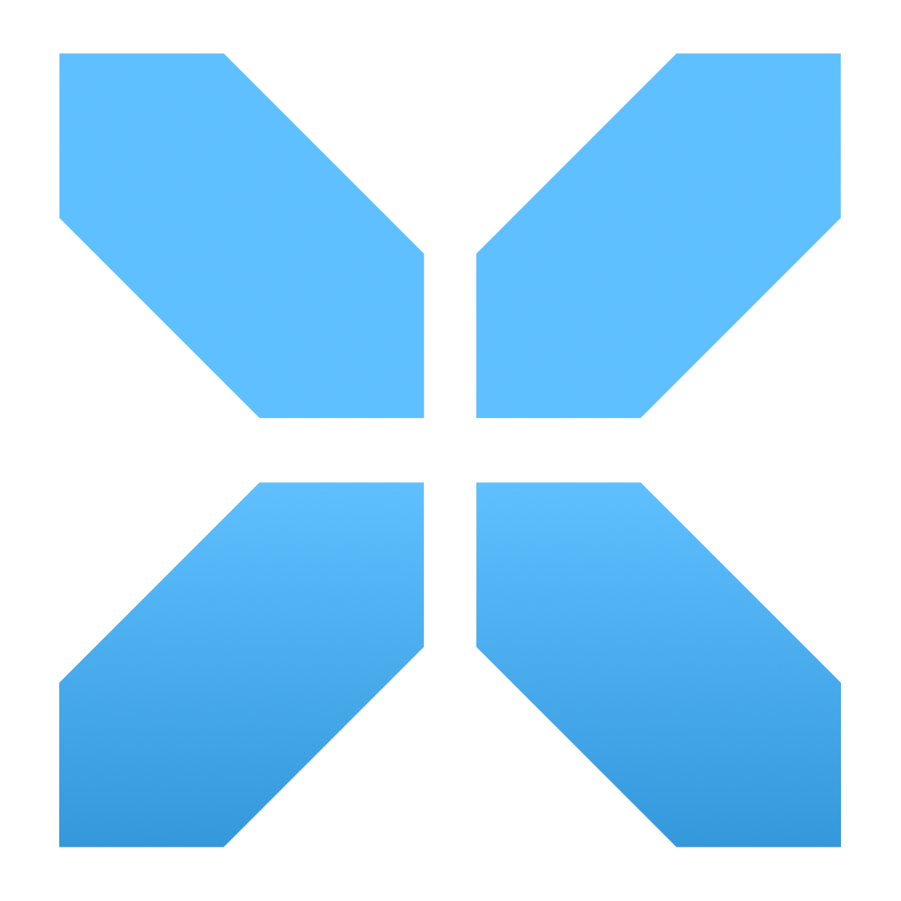

<!-- 

  
  <h1>TriggerX</h1>
  
<strong>Your One-Stop Blockchain Automation Solution</strong>

 -->

  
  <!-- <h1>TriggerX</h1> -->

  
<strong>Join us in revolutionizing blockchain automation</strong>

  
  
  
  

## 🎯 Mission
To empower blockchain projects by providing trusted, cross-chain automation solutions that work effortlessly across the multi-chain landscape, accelerating industry growth and fostering a more interconnected blockchain ecosystem.

## 💡 Introduction
In the rapidly expanding blockchain landscape, particularly with new L2 solutions, reliable automation has become crucial. TriggerX addresses the critical shortage of trusted automation solutions by providing a comprehensive platform that eliminates dependence on centralized providers or complex custom-built systems.

## 🔑 Key Features

### 🛠 Comprehensive Automation Types
- **⏰ Time-Based Automations**: Schedule contract calls based on intervals or specific times
- **🔄 Event-Based Automations**: Trigger actions when specific on-chain events occur
- **📊 Condition-Based Automations**: Automate responses based on predefined conditions

### 🛡 Enhanced Security
- Crypto-Economic Security via EigenLayer and AVS
- Decentralized Keeper Networks
- Robust security infrastructure for operator management

### 🌐 Multi-Chain Architecture
- Seamless expansion to new L2 chains
- Simple configuration-based chain integration
- Instant deployment capabilities

## 💼 Use Cases

### For Developers & dApps
- Automated API Calls for off-chain data integration
- User notification systems
- Automated liquidity rebalancing
- Scheduled governance action execution

### For Enterprises
- Event-triggered airdrops
- Automatic token burns or mints
- Custom automation solutions
- Cross-chain operations management

## 🔮 Vision
TriggerX envisions a blockchain ecosystem where automated, reliable, and secure services are accessible across all platforms, driving mass adoption and making blockchain technology more user-friendly.

